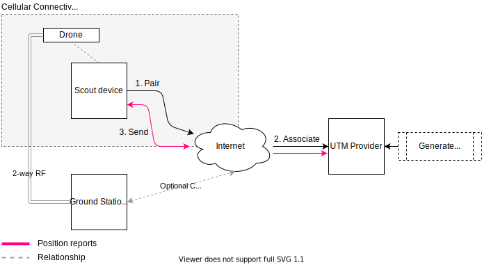
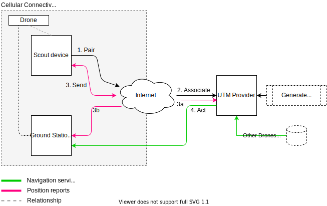

# Altitude Angel

This document describes how to connect a _Scout_ device to  the [Altitude Angel](https://www.altitudeangel.com/) UTM platform.

## Supported Capabilities

The table below lists the UTM services provided by Altitude Angel, and whether or not the corresponding functionality has yet been implemented in _Scout_. 

| Service       | Description                                                                                                                                                                                                                       | Available on Altitude Angel | Implemented in Scout Firmware |
| ------------- | --------------------------------------------------------------------------------------------------------------------------------------------------------------------------------------------------------------------------------- | --------------------------- | ----------------------------- |
| Surveillance  | Receives position reports from one or more remote sensors, such as _Scout_ devices                                                                                                                                                            | Yes                         | Yes, from v0.1                |
| Strategic CRS | Receives flight plans, pre-flight, and compares them either with your other flight plans or optionally, those received across all of Altitude Angel's network, and helps you to plan-to-avoid conflicts with other drone flights. | Yes                         | Not yet                       |
| Tactical CRS  | Responds to position reports sent via _Surveillance_ with instructions to help you avoid a potential collisions with a manned aircraft, other drones, or breaching airspace rules as they change while you fly, under certain conditions. | Yes                         | Coming in v0.2                |

You can find the full suite of API services offered by Altitude Angel at https://docs.altitudeangel.com/.

## Getting started

The first thing we need to do is to _associate_ a new _Scout_ device with your developer account.

To do this:

1. Go to [Altitude Angel's Developer site](https://developers.altitudeangel.com/) and create a free developer account.

:warning: Please pay attention to the terms and conditions. In particular, note that use of any UTM service is *not* a replacement for your normal legal and professional obligations as a drone pilot.

2. Once setup, [open a support ticket](https://customerportal.altitudeangel.com/) and let us know the email address of your new developer account, requesting authorization to associate a new _Scout_ device (or devices) with your account. You'll first need to know the IMEI number for each of your _Scout_ devices you want to associate (if you have a lot, let us know - and we can help you out so you don't have to specify them all). We aim to arrange all approvals within about a working day, or less.

3. You're all set! You can now send/receive telemetry and navigation support from all of Altitude Angel's UTM services supported by _Scout's_ current firmware, and we'll update this guide shortly to show you several common usage scenarios and how to do this successfully.

## Typical basic Remote ID implementation

In a typical usage scenario, you'll connect your _Scout_ device to Altitude Angel's [Surveillance](https://docs.altitudeangel.com/docs/surveillance-api) API. The basic process for doing this looks like this:

By way of exaplanation, in the flow above, we're effectively:

1. Pairing the device with the Altitude Angel Surveillance API
2. Altitude Angel's UTM Services will issue a globally-unique Remote ID to be used for your flight.
3. Sending position reports through the Surveillance API to Altitude Angel, using the Remote ID.
4. Flying!

This is enough for a basic Remote ID implementation!

## Advanced integration with Altitude Angel 

However, using Altitude Angel, you're able to receive navigation assistance during your flight. In this flow, there are lots of possibilities for relaying position reports and receiving data to/from the drone, and if you wish, separating out the transmission channel for position reports so they can originate _direct_ on the drone, and _receive_ instructions from Altitude Angel via your Ground Station, on a separate channel:

This scenario features integrations with additional APIs, so you'll also need to:

* Submit a flight plan via strategic CRS for your flight using the Scout device identifier
* Start a flight for the flight plan requesting the tactical CRS service
* Integrate with the tactical CRS service using:
  * Your ground control station, and/or
  * (In an upcoming version of Scout) Directly with your drone avionics via I2C

Submitting flight plans via strategic CRS and getting navigation assistance using the tactical CRS service require some additional set up and integration. If you're interested in understanding more about using these services, don't hesitate to get in touch via the [Customer Portal](https://customerportal.altitudeangel.com/).

#### Pairing your device with your Altitude Angel account

To pair _Scout_: 

1. Open a web browser to the [Surveillance Provisioning Portal](https://surveillance.altitudeangel.com/), sign-in with your developer account, and navigate to _Pair Devices_. 

2. Press and hold the _pair button_ on your Scout device for about 1 second, until the pair LED starts slowly flashing on and off. This indicates pairing is in progress. 

3. Go back to the _Pair Devices_ screen, click on the _Pair_ button next to your device to initiate pairing with your _Scout_ device. This allows your _Scout_ device to request a secure token from the Surveillance platform, which it will then use to authenticate with the service later.

4. When _Scout_ has received a token from the Surveillance API, the pair LED will start flashing faster, and once it has been able to get a GPS lock and successfully report a GPS location to the Surveillance API the pair LED will turn off and only flash each time a report is sent to the Surveillance API, which should be roughly once every second. Note that you may need to go _outside_ in order to obtain a GPS lock.
