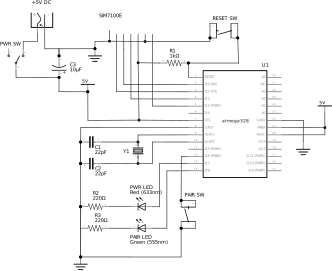

# Scout Hardware

This directory contains the _hardware plans and schematics_ for the _Scout_ device. You'll also need the firmware to get a fully working device, so head over to the [Scout Firmware](../firmware/README.md) section for the source code and a guide on how to compile and upload the firmware to your device.

## Getting Started

This guide assumes that you are familiar with building small-scale electronics projects for the [Arduino](https://www.arduino.cc/) platform.

This includes building projects on a breadboard, sourcing and buying electronic components, ordering or manufacturing PCBs (if you're _that_ keen!), and soldering both through-hole and surface mount components. In addition, this directory also contains information on building an enclosure for the Scout device using plans for a 3D printer.

If you want to build the Scout hardware on a breadboard (which is always a good idea to prototype before heading straight to manufacturing) then consult the [Breadboard Build Guide](breadboard/BreadboardBuildGuide.md) to get started.

To build a 'standalone' Scout device based on the plans in this repository that could be securely attached to a drone to provide remote ID, drone telemetry and navigation assistance, then consult the [PCB Build Guide](pcb/PCBBuildGuide.md). For a suitable case for the standalone Scout hardware, consult the [Case Build Guide](case/CaseBuildGuide.md).

:warning: Do keep in mind that this project is open-source, and provided "as-is". We do _not_ recommend that you proceed straight to manufacturing a PCB without first becoming familiar with a working breadboard prototype, and exploring whether the reference designs contained herein are suitable for your specific purposes.

## Overview

There are four main logical parts to the hardware:

- microcontroller;
- cellular modem (which includes, in our design, an onboard GPS/GLONASS sensor);
- user interface; and
- power supply. 

The following sections describe each of these logical parts and how they interact.

## Microcontroller

The brains of the _Scout_ hardware is the microcontroller, which is currently an [ATmega328p](https://en.wikipedia.org/wiki/ATmega328), the same microcontroller at the centre of an Arduino Uno and Nano. This is where the firmware is uploaded to and runs, and is responsible for interfacing with the User Interface components, the Modem Module, and a drone through an I2C bus. 

| The ATmega328p is an 8-bit AVR CPU, with 32KB of flash memory, running at a clock speed of 16 MHz. You might be thinking that this is very low-specification, and you're _completely_ right! Being low-specification doesn't mean low capability, however, and running at such a low clock speed helps power efficiency.

The choice of the Arduino platform for the microcontroller was based also on the large global community and ecosystem of parts around the Arduino project and the wide range of guides and support that already exists. This is the very DNA on which the emergence of drone technology in its earlier years also started to take flight.

In future versions of Scout we'd like to expand the microcontroller options, both to enable both more complex and capable microcontrollers to add additional features, and perhaps even smaller ones too.

## Modem Module

If the microcontroller is the 'brains' of Scout, then the modem module is the mouth and ears! The module we've selected, however, also provides GPS/GLONASS functionality. Thus, in one small, relatively power-efficient chip, you get accurate positioning as well as the 2G/3G/4G modem to provide a two-way communication channel to the UTM provider.

There are many available modem modules available on the market, from many different suppliers and different capabilities and price points. And, as this project is open source, you can also swap out the communications hardware to perhaps opt for satellite communications, or multiple communications streams: it's up to you to pick the combination that works best for your scenario. 

We started out with the Simcom [SIM7100E](https://simcom.ee/modules/lte/sim7100e/), but expect this project to expand the choices available, both to simpler and lower priced options and more complex ones too. The minimum key requirements of the modem module is that it provides GPS positioning and internet connectivity, and it interfaces to Scout via a serial UART and a "Hayes Modem" command set, which the vast majority of available modem modules do.

## User Interface

To enable users to interact with Scout and understand what it's doing it also needs a User Interface, and this is comprised of simple, robust combination of a few switches and LEDs, helping us to minimise complexity and maximise power-efficiency. There is a single power switch to turn the unit on and off, and a 'pairing' button used to initiate pairing and authentication with a compatible UTM Provider. In addition, there are two LEDs: one to indicate the power-up status of the Scout hardware, and the other to indicate the status of the pairing and connection process. 

These LEDs flash at different rates to indicate different states in the hardware:

- Slow - On for 500ms, off for 500ms
- Medium - On for 250ms, off for 250ms
- Fast - On for 100ms, off for 100ms
- Flash - A single pulse for 50ms

| Power LED | Pair LED | Description                                                                              |
| --------- | -------- | ---------------------------------------------------------------------------------------- |
| Off       | Off      | Scout is powered off                                                                     |
| Slow      | -        | Establishing communication with the modem module                                         |
| Medium    | -        | Setting up the modem, synchronizing time, enabling network and GPS                       |
| Fast      | -        | Establishing network connection to the backend service                                   |
| Steady    | -        | Ready to pair or running                                                                 |
| -         | Slow     | Pairing is in progress                                                                   |
| -         | Fast     | Pairing token obtained, establishing GPS lock, and authenticating to the UTM Provider    |
| -         | Flash    | Indicates a position report has been successfully sent                                   |
| Slow      | Slow     | Alternate power/pair slow flashing indicates a fatal device error                        |
| Fast      | Fast     | Alternate power/pair fast flashing indicates the device is resetting                     |

## Power Supply

Lastly, like all electronic devices, Scout needs power (but not much!).

If you're building Scout on a breadboard then a simple bench 5VDC 2A power supply will suffice, but when it is standalone and attached to a drone it needs to run from a battery. In theory, you could power Scout from the battery system already on a drone, but unless you're designing your own drone hardware, that's fairly invasive, and is likely to at least invalidate your warranty, and at worst, affect the flight dynamics of your vehicle. 

The battery is also the heaviest component in _Scout_, which is crucial consideration for any airborne device, but also determines the available run time of the device. Getting the balance right can be tricky. The modem module is the biggest consumer of power in Scout, and from it's datasheet needs 5V at up to 2 amps, although we've observed this be more like 2-5W on average in actual operation, so whichever battery cell you end up choosing you should be mindful of the potential current draw.

In the current design, battery power comes from an 18650 Lithium Ion battery. This was initially chosen because they are very readily available and can deliver the current required to power the modem module. However, this is something we intend to change as these batteries are also quite heavy and somewhat over-specified for the typical power requirements of Scout. In the near future Scout will use a pouch type Lithium Polymer battery. These can deliver lower peak currents, but sufficient for Scout with suitable capacities and in a smaller, lighter and slightly safer form to Lithium Ion.

In addition to the battery, the power supply circuitry enables safe charging of the battery through a Micro USB connector and charge controller, protection of the battery from over-charging, under-charging, short circuit and reverse polarity, and lastly a DC-DC converter to supply a constant and stable 5 volts to the microcontroller and modem module.

# Licence

The Scout hardware is licensed under [Creative Commons BY-SA](https://creativecommons.org/licenses/by-sa/4.0/).

Made with 💗 by Altitude Angel
