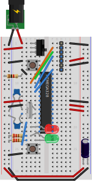
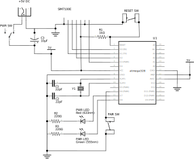

# Breadboard Build Guide
This guide will show you how to build the basic Scout hardware on a breadboard, how to flash the firmware onto microcontroller, and set up debugging the firmware. This will enable you to start experimenting with the hardware and firmware and to debug it.

If you've not built an Arduino on a breadboard before, it is recommended you read and familiarize yourself with the [Building an Arduino on a Breadboard](https://www.arduino.cc/en/Main/Standalone) documentation on the Arduino site first, as much of this guide is based on this.

> Many thanks to [Fritzing](https://fritzing.org/) for the excellent software that enabled us to create the breadboard layout and schematics.

## Parts List

The main Scout hardware on a breadboard requires the following components:

* 1 x Breadboard (0.1" pitch, half+ size - 30x10 contacts with power rails)
* 1 x SIMCOM SIM7100E DevKit board
* 1 x ATMEL ATmega382P-PU (28-pin DIP package)
* 1 x 16Mhz clock crystal
* 2 x 22pF ceramic capacitors
* 1 x 10uF electrolytic capacitor
* 2 x 220Ω resitors
* 1 x 1kΩ resistor
* 1 x Red LED
* 1 x Green LED
* 2 x push button switches
* 1 x toggle switch
* Connecting wire
* +5V power supply capable of delivering up to 2A

For programming the firmware you'll addtionally need:

* 1 x Ardunio Uno
* 1 x 10uF electrolytic capacitor
* Connecting wire
* Computer with the Ardunio IDE installed

And for debugging you'll also need:

* 2 x Serial to USB adapters (FTDI-based or similar)
* Connecting wire

## Layout

The layout of the breadboard is shown in the diagram below, along with the schematic for the circuit. These can also be downloaded in [Fritzing format](../Scout-Fritzing.fzz).

Start by locating the ATMega328P in the middle of the breadboard, as everything connects to this in some way, and then connect wires between the power supply rails and the other components, starting with the low lying components first (switches and connecting wires) and moving on to the raised components to finish (LEDs, resistors, capacitors). Finally, connect the SIM7100E DevKit board (shown on the layout as just a 7-pin header, but will actually hang off the breadboard), and with the power switch in the off position, connect up the power supply to the power supply rails.

## Programming

Programming the Scout firmware onto the ATMega328P microcontroller uses a separate Arduino as an In-circuit Serial Programmer (ISP). The details of doing this are covered in the [Arduino ISP Tutorial](https://www.arduino.cc/en/Tutorial/ArduinoISP) on the Arduino website. The steps involved are:

* Connect an Arduino Uno to your computer over USB.
* Open the Arduino IDE and open the ArduinoISP sketch from the Examples in the IDE.
* Select the Arduino Uno as the board and the correct serial port to program it, and them compile and upload the ArduinoISP sketch to the Arduino Uno.
* Disconnect your breadboard circuit from your power supply
* Connect your Arduino Uno to your breadboard as follows:
  * ATMega328P pin 1 RESET (breadboard left side, row 8) to Uno digital pin 10
  * ATMega328P pin 17 MOSI (breadboard right side, row 19) to Uno digital pin 11
  * ATMega328P pin 18 MISO (breadboard right side, row 18) to Uno digital pin 12
  * ATMega328P pin 19 SCK (breadboard right side, row 17) to Uno digital pin 13
  * Power rail GND (-) to Uno GND
  * 10uF electrolytic capacitor between Uno GND and Uno RESET (ensure capacitor -ve is connected to GND)
  * Power rail +5V to Uno +5V

Once this is done the Scout firmware can be programmed onto the microcontroller. To do this open the Scout sketch in the Arduino IDE and select Arduino as ISP in the Tools/Programmer menu. Then run the Upload Using Programmer and the sketch will be built and uploaded to the microcontroller. You will know this is complete when the Power LED starts flashing on and off every 500ms, indicating that communications is trying to be established with the modem module.

## Debugging

When developing and debugging the firmware, it is often essential to be able to see the communications between the microcontroller and the modem module. To do this it is simplest to use two serial to USB adapters to monitor the serial communication on the receive and transmit lines between the microscontroller and the modem module. Connect the two serial to USB adapters so that their GND is common with the breadboard power rail GND, and then connect the receive input of one of the adapters to RXD on the microcontroller (ATMega328P pin 2, breadboard left side, row 9), and the other adapter receive input to TXD on the microcontroller  (ATMega328P pin 3, breadboard left side, row 10). Then on your computer you will be able to open up two serial monitors on the two USB adapter COM ports (115200 baud, 8 data bits, 1 stop bit) and watch the communication between the microcontroller and modem module.