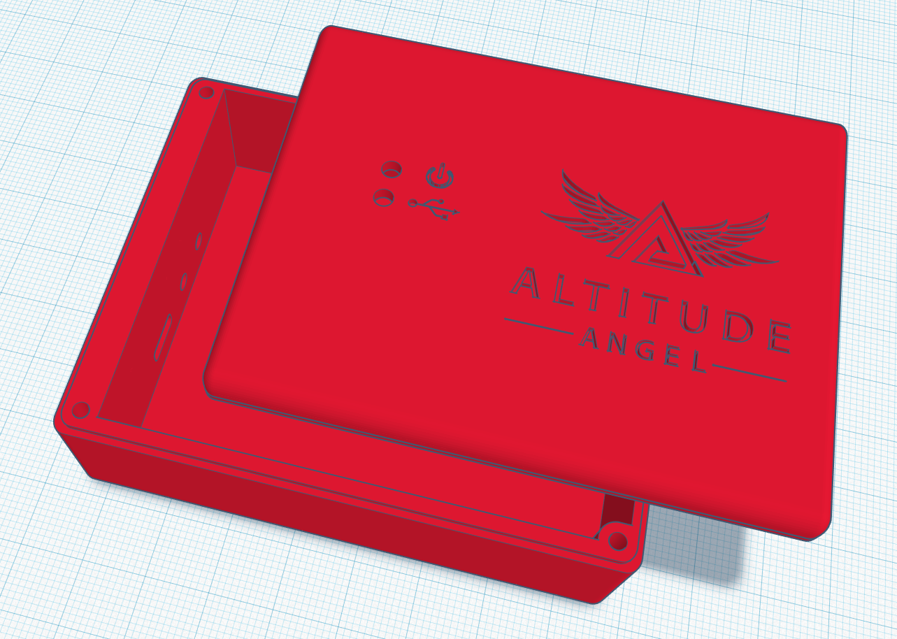
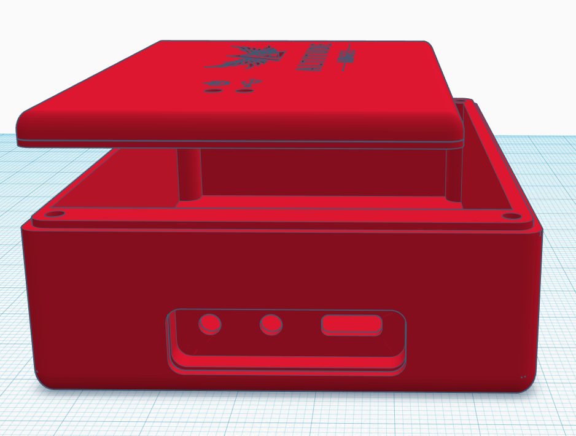

# Case Build Guide

A simple case has been designed to house the standalone Scout hardware, including the PCB, battery and module module, and is available in [STL format](ScoutCase.stl). This case can be 3D printed using any suitable 3D printing hardware with a minimum print volume of approximately 180mm x 150mm x 25mm. We have currently tested printing this case using a Creality Ender 3 and black PLA filament, and it works well, but in common with good 3D prints it is important to ensure good bed leveling, a maximum layer height of 0.2mm, and to experiment with extrusion settings to get the best possible finish. This is another area where community input will be valuable by sharing our 3D printer successes and failures and getting good settings that work.

The case includes top holes to enable the LEDs to been seen and side holes to enable access to the power and pair switches and the Micro USB connector for charging. The top LED holes are 3mm in diameter and designed to enable 3mm clear acrylic rod to be glued into them as light guides the to surface mount LEDs on the PCB underneath, and sealing the case from the elements.

Included in the case model is a mould the correct shape for a bung to be created that fits the side of the case to protect the switches and Micro USB connector underneath from the elements. To create this bung, first lightly wet the mould with water and then fill it tightly with silicone sealant. Once full scrape off the top of the mould to get a flat finish and wait for the sealant to dry completely. Once dry it should be possible to pull the silicon from the mould, and it should fit nicely into the recess in the side of the case.

The lid of the case is fixed to the body with 4 x 25mm M2 bolts, and is designed with a lip to both ensure a snug fit to the body and so that silicon sealant could additionally be applied for further waterproofing.

The PCB should be fixed in the case using a 1mm thick foam adhesive pad.

