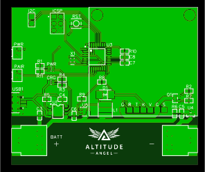
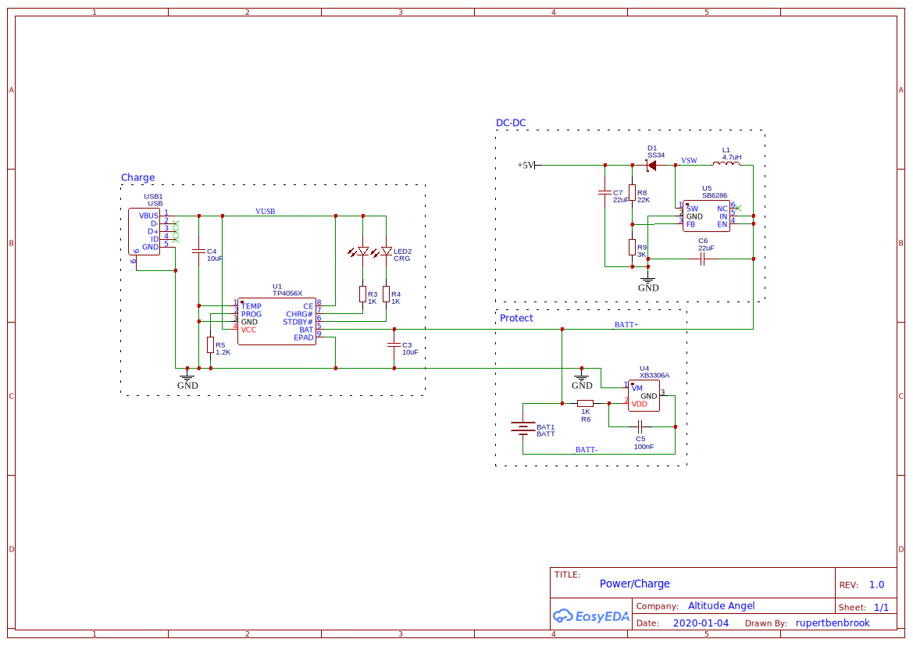
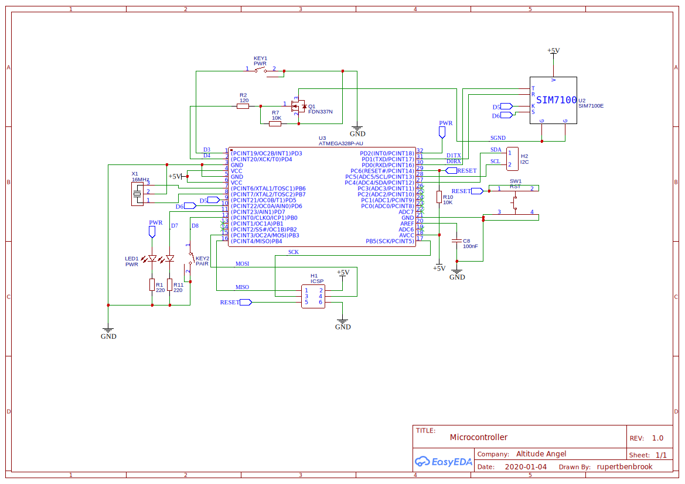

# PCB Build Guide

This guide will show you how to build the PCB for the Scout hardware and how to flash the microcontroller on the PCB.

> Many thanks to [EasyEDA](https://easyeda.com/) for the excellent software that enabled us to create the PCB layout and schematics, and prototype PCBs for testing.

## Overview

The design of the PCB is focused on ease of self-assembly and to enable the Scout circuit to be self-contained in a case for mounting to a drone. This brings together the microcontroller and modem module with a Li-Ion battery, MicroUSB charging circuit, battery protection and a DC-DC converter. The design currently uses an 18650 Lithium Ion battery, but it is envisaged that this will become a pouch-based Lithium Polymer battery in future designs to enable the size and weight to be shrunk further. In addition, this iteration of the design uses the off-the-shelf modem module connected via a PCB header, but future designs will integrate this module onto the PCB, again to shrink its size and weight.

* PCB approx. dimensions: 69mm x 59mm x 23mm
* PCB approx. weight, incl. battery: 75g

## Parts List

The parts needed to build the PCB are listed in the table below. These can also be downloaded as a CSV [Bill Of Materials](BOM.csv) and a CSV [Pick And Place](PickAndPlace.csv) specification for manufacturing.

|  Qty | Designators | Manufacturer       | Part                              |
| ---: | ----------- | ------------------ | --------------------------------- |
|    1 | U1          | Nanjing            | TP4056X (battery charger)         |
|    1 | U3          | MICROCHIP          | ATMEGA328P-AU                     |
|    1 | U4          | Xysemi             | XB3306A (battery protection)      |
|    1 | U5          | SHOUDING           | SB6286 (dc-dc power)              |
|    1 | Q1          | ON Semicon         | FDN337N (mosfet)                  |
|    1 | D1          | MDD                | SS34                              |
|    1 | L1          | Murata Electronics | LQH5BPN4R7NT0L                    |
|    1 | X1          | MuRata             | CSTCE16M0V53-R0 (16MHz resonator) |
|    1 | LED1        | Lite-On            | LTST-C195KGJRKT                   |
|    1 | LED2        | Lite-On            | LTST-C195KGJRKT                   |
|    2 | R1,R11      | RALEC              | RTT032200FTP                      |
|    1 | R2          | RALEC              | RTT031200FTP                      |
|    3 | R4,R3,R6    | RALEC              | RTT031001FTP                      |
|    1 | R5          | RALEC              | RTT031201FTP                      |
|    2 | R7,R10      | RALEC              | RTT031002FTP                      |
|    1 | R8          | RALEC              | RTT032202FTP                      |
|    1 | R9          | RALEC              | RTT033001FTP                      |
|    1 | USB1        | SHOU HAN           | MICRO5.9mmusb (MicroUSB)          |
|    2 | C3,C4       | MuRata             | GRM188R61A106KE69D                |
|    2 | C6,C7       | MuRata             | GRM188R61A226ME15D                |
|    2 | C8,C5       | MuRata             | GRM188R71C104KA01D                |
|    1 | H1          | BOOMELE            | Header-Male-2.54_2x3              |
|    1 | H2          | TE Connectivity    | 826629-2                          |
|    2 | KEY1,KEY2   | GANGYUAN           | KAN4562-0501C                     |
|    1 | SW1         | XKB Enterprise     | TS-1177-B-A-B                     |

## Layout

The overall layout of the PCB is shown in the diagram below, as well as separate files for each of the individual PCB layers, Gerber files for manufacturing, and the schematics for the circuit. These can also be downloaded in [EasyEDA format](../Scout-Scout-EasyEDA.json).



### PCB Layers 

* [Bottom](BottomLayer.svg)
* [Bottom Solder Mask](BottomSolderMaskLayer.svg)
* [Document](Document.svg)
* [Multi Layer](Multi-Layer.svg)
* [Top](TopLayer.svg)
* [Top Paste Mask](TopPasteMaskLayer.svg)
* [Top Silk](TopSilkLayer.svg)
* [Top Solder Mask](TopSolderMaskLayer.svg)

### Gerber Files

* [Board Outline](Gerber_BoardOutline.GKO)
* [Bottom Layer](Gerber_BottomLayer.GBL)
* [Bottom Solder Mask](Gerber_BottomSolderMaskLayer.GBS)
* [Drill Non-Plated Through Holes](Gerber_Drill_NPTH.DRL)
* [Drill Plated Through Holes](Gerber_Drill_PTH.DRL)
* [Top Layer](Gerber_TopLayer.GTL)
* [Top Paste Mask](Gerber_TopPasteMaskLayer.GTP)
* [Top Silk](Gerber_TopSilkLayer.GTO)
* [Top Solder Mask](Gerber_TopSolderMaskLayer.GTS)

## Schematics





## Programming

Programming the Scout firmware onto the ATMega328P microcontroller is very similar to programming on a breadboard and uses a separate Arduino as an In-circuit Serial Programmer (ISP). The details of doing this are covered in the [Arduino ISP Tutorial](https://www.arduino.cc/en/Tutorial/ArduinoISP) on the Arduino website. The steps involved are:

* Connect an Arduino Uno to your computer over USB.
* Open the Arduino IDE and open the ArduinoISP sketch from the Examples in the IDE.
* Select the Arduino Uno as the board and the correct serial port to program it, and them compile and upload the ArduinoISP sketch to the Arduino Uno.
* Disconnect your PCB circuit from the battery or Micro USB
* Connect your Arduino Uno to your PCB using the ICSP header (H1) follows:
  * ICSP pin 5 RST to Uno digital pin 10
  * ICSP pin 4 MOSI (breadboard right side, row 19) to Uno digital pin 11
  * ICSP pin 1 MISO (breadboard right side, row 18) to Uno digital pin 12
  * ICSP pin 3 SCK (breadboard right side, row 17) to Uno digital pin 13
  * ICSP pin 6 GND (-) to Uno GND
  * 10uF electrolytic capacitor between Uno GND and Uno RESET (ensure capacitor -ve is connected to GND)
  * ICSP pin 2 VCC to Uno +5V

```
AVR ICSP 6-pin Header
     /---+---+
MISO | 1 | 2 | VCC
     +---+---+
 SCK | 3 | 4 | MOSI
     +---+---+
 RST | 5 | 6 | GND
     +---+---+
```  

Once this is done the Scout firmware can be programmed onto the microcontroller. To do this open the Scout sketch in the Arduino IDE and select Arduino as ISP in the Tools/Programmer menu. Then run the Upload Using Programmer and the sketch will be built and uploaded to the microcontroller. You will know this is complete when the Power LED starts flashing on and off every 500ms, indicating that communications is trying to be established with the modem module.